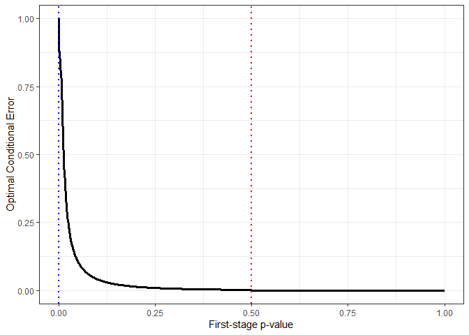

<!-- README.md is generated from README.Rmd. Please edit that file -->

# optconerrf

<!-- badges: start -->

[](https://github.com/morten-dreher/optconerrf/actions/workflows/R-CMD-check.yaml)
[](https://r-pkg.org/pkg/optconerrf)
[](https://cran.r-project.org/web/checks/check_results_optconerrf.html)
<!-- badges: end -->

The goal of `optconerrf` is to enable the use of adaptive two-stage
clinical trial designs with the optimal conditional error function
approach proposed by Brannath & Bauer (2004). The optimal conditional
error function minimises the expected second-stage sample
size/information under the assumption that the true effect size is
known. As an extension to the original methodology, `optconerrf` allows
the effect size used to plan the second stage to depend on the interim
data.

## Installation

You can install the development version of optconerrf from
[GitHub](https://github.com/) with:

``` r
# install.packages("devtools")
devtools::install_github("morten-dreher/optconerrf")
```

Installing from CRAN can be done via:

``` r
install.packages("optconerrf")
```

## Example

A design object with the following properties:

- overall type I error rate 0.025 (`alpha = 0.025`)
- early efficacy boundary 0.0001 (`alpha1 = 0.0001`, p-value scale)
- binding futility boundary 0.5 (`alpha0 = 0.5`, p-value scale)
- conditional power 0.9 (`conditionalPower = 0.9`)
- assumed treatment effect of 0.25 (`delta1 = 0.25`)
- no use of interim estimate (i.e., always using `delta1` to plan the
  secon d stage, `useInterimEstimate = FALSE`)
- first-stage information 100 (`firstStageInformation = 100`)
- fixed likelihood ratio distribution
  (`likelihoodRatioDistribution = "fixed"`) with effect 0.25
  (`deltaLR = 0.25`) (i.e., minimising the expected second-stage
  information under the assumption that the true effect size is 0.25)

can be generated by the code below.

``` r
library(optconerrf)
trialDesign <- 
  getDesignOptimalConditionalErrorFunction(
    alpha = 0.025,
    alpha1 = 0.0001,
    alpha0 = 0.5,
    conditionalPower = 0.9,
    delta1 = 0.25,
    useInterimEstimate = FALSE,
    firstStageInformation = 100,
    likelihoodRatioDistribution = "fixed",
    deltaLR = 0.25
  )
```

The design object can then be passed to other central package functions,
such as `getExpectedSecondStageInformation()`:

``` r
getExpectedSecondStageInformation(
  trialDesign,
  likelihoodRatioDistribution = "fixed",
  deltaLR = 0)
#> [1] 99.84901
```

The above code calculates the expected second-stage information of the
design for a scenario under the null hypothesis (`deltaLR = 0`).

`optconerrf` also implements `plot()` and `print()` generics:

``` r
plot(trialDesign)
```



``` r
print(trialDesign)
#> Optimal Conditional Error Function Design: 
#>  
#> General design parameters: 
#>   Overall significance level: 0.025 
#>   First-stage efficacy boundary (p-value scale): 1e-04 
#>   Binding first-stage futility boundary (p-value scale): 0.5 
#> 
#> Conditional power specification: 
#>   Target conditional power: 0.9 
#>   Alternative: 0.25 
#>   First-stage non-centrality parameter: 2.5 
#>   First-stage information: 100 
#> 
#> Likelihood ratio specification: 
#>   Fixed parameter(s) in likelihood ratio:  0.25 
#>   Parameter weights:  1 
#> 
#> Level constant: 
#>   Constant: 7.079328 
#>   Searched on interval: [0, 10]
```
